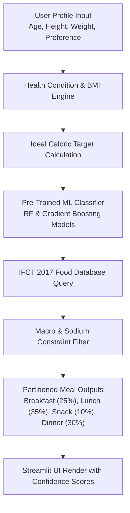

# 🍎 SmartDiet — Your Personal Meal Guide

Personalized daily meal plans matched to your health situation using machine learning & government nutrition tables.

SmartDiet helps you find the right meals for your health condition — whether managing diabetes, high blood pressure, weight, or seeking general wellness. Built with Streamlit and scikit-learn, SmartDiet calculates your daily calorie goal and suggests authentic regional dishes from the Indian Food Composition Tables (IFCT 2017) database.

[](https://smartdiet-recommendation.streamlit.app)

    

---

## ⚡ Key Highlights & Value Proposition

- **Scientific Database Integration**: Integrates nutritional breakdowns for 214+ authentic dishes based on the **Indian Food Composition Tables (IFCT 2017)** from the National Institute of Nutrition.
- **ML Recommendation Engine**: Employs pre-trained **Random Forest** and **Gradient Boosting** classifiers to score dish suitability with explicit confidence percentages (e.g., $90\%$ match score).
- **Proportional Caloric Splitting**: Automatically partitions target caloric goals across daily meals: **Breakfast (25%)**, **Lunch (35%)**, **Snack (10%)**, and **Dinner (30%)**.
- **Condition-Specific Optimization**: Tailors macro and sodium limits for specific health contexts:
  - 🩸 **Diabetes Management**: Keeps glycemic impact steady with high-fiber options.
  - 🫀 **Hypertension Control**: Regulates sodium threshold per meal.
  - ⚖️ **Weight Management**: Optimizes protein-to-carbohydrate ratios.

---

## 🛠️ Tech Stack & Architecture

| Layer | Technology | Purpose |
|---|---|---|
| **UI Framework** | [Streamlit](https://streamlit.io/) | Interactive client interface & responsive input sidebars |
| **Recommendation Engine** | [scikit-learn](https://scikit-learn.org/) | Pre-trained Random Forest & Gradient Boosting scoring models |
| **Data Engine** | [Pandas](https://pandas.pydata.org/), [NumPy](https://numpy.org/) | Dataset indexing, calorie calculations, & macro aggregations |
| **Model Persistence** | `joblib` / `pickle` | Serialized model artifacts (`rf_model.pkl`, `scaler.pkl`, encoders) |
| **Visual Analytics** | [Matplotlib](https://matplotlib.org/) | Daily macro breakdown charts & calorie progression graphs |

---

## 🏗️ System Workflow & Recommendation Pipeline



---

## 📁 Repository Structure

```tree
smartdiet/
├── app.py                      # Main Streamlit application entrypoint
├── requirements.txt            # Dependency manifest
├── model/
│   ├── rf_model.pkl            # Trained Random Forest classifier
│   ├── gb_model.pkl            # Trained Gradient Boosting classifier
│   ├── scaler.pkl              # Feature scaler artifact
│   ├── le_*.pkl                # Label encoders (diet, meal, dish target)
│   ├── meals_extended_labelled.csv # IFCT 2017 nutritional dataset
│   └── meta.json               # Model training metadata
└── README.md                   # Documentation
```

---

## 🚀 Quick Start & Local Setup

### 1. Clone & Set Up Directory
```bash
git clone https://github.com/tarun05-design/smartdiet-recommendation-system.git
cd smartdiet-recommendation-system
```

### 2. Create Virtual Environment
```bash
# Windows
python -m venv venv
venv\Scripts\activate

# macOS / Linux
python3 -m venv venv
source venv/bin/activate
```

### 3. Install Dependencies
```bash
pip install -r requirements.txt
```

### 4. Run Application
```bash
streamlit run app.py
```
Access the dashboard at `http://localhost:8501`.

---

## 👤 Author & Connect

**Tarun P** — Machine Learning & Full Stack Developer
- 🌐 Portfolio: [tarun-portfolio.vercel.app](https://tarun-portfolio.vercel.app)
- 🐙 GitHub: [@tarun05-design](https://github.com/tarun05-design)
- 📧 Email: [tarunparthasarathy65@gmail.com](mailto:tarunparthasarathy65@gmail.com)
